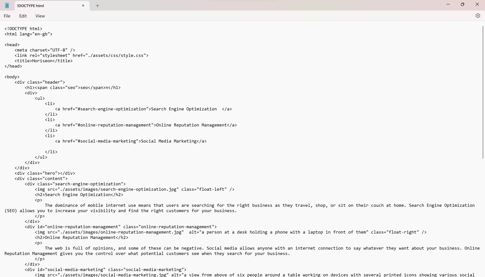

# **01 HTML CSS Git: Code Refactor**

## **Description**

The 'Horiseon' webpage was refactored to ensure the page followed accessibility standards and the site was optimised for search engines, ensuring all links functioned correctly.

The following was carried out in order to achieve the desired outcome: 
* Semantic HTML elements were added throughout the source code
* HTML elements were checked to follow a logical structure independent of styling and positioning
* Accessible 'alt' attributes were added to image and icon elements
* Heading attributes were checked to fall in sequential order
* The Title element was changed to a concise, descriptive title
* CSS selectors were consolidated, where applicable

The following image showed the original web application's appearance and functionality:

The deployed page can be found here: 

### **Installation**

N/A

#### **Usage**

To copmpare the newly-deployed code with the original, the screenshots below show the original code:

##### **Credits**

The following resources were used for the required code changes in the index.html and style.css files:

https://www.w3schools.com/html/html5_semantic_elements.asp
https://developer.mozilla.org/en-US/docs/Glossary/Semantics
https://www.w3schools.com/css/css_selectors.asp

Guidance was received from tutor, Beniceio Lopez during a 50-minute tutoring session.

I also worked in collaboration with several other students to start the refactoring during the initial class challenge session.

###### **Licence**

Please refer to the LICENCE in the repo.

